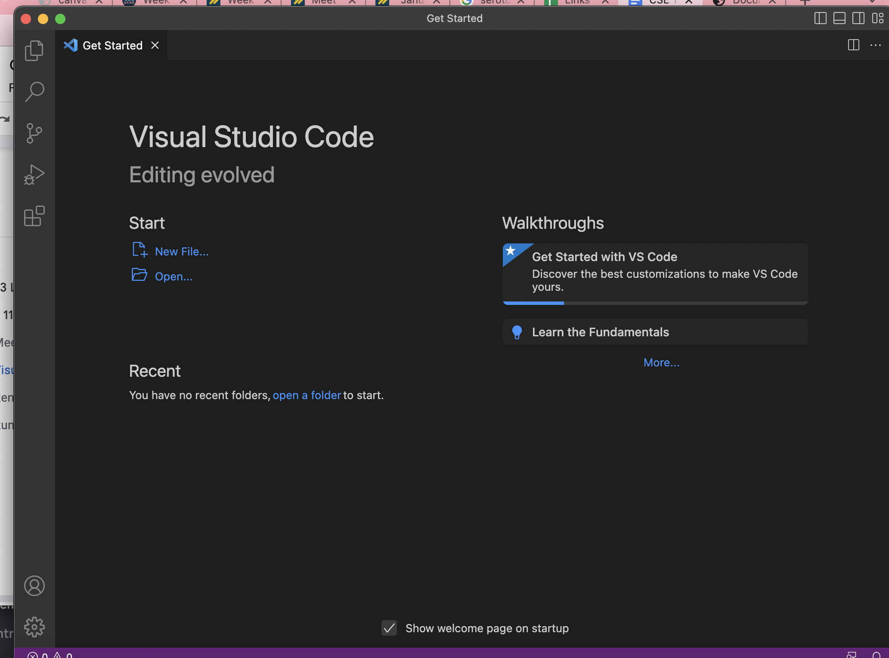
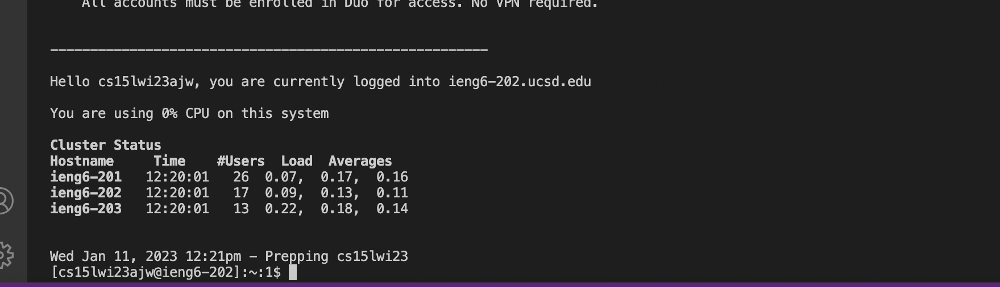
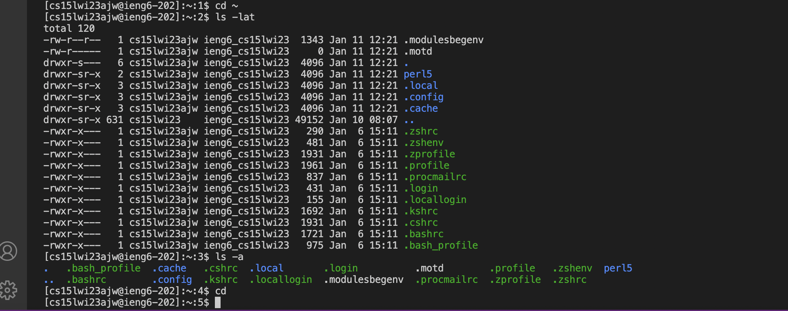

# Lab 1
Before completing the steps below, make sure you have your login information. (you have looked up your account username and set its password).
1. Download Visual Studio Code in your respective computer version. The link is here: https://code.visualstudio.com/ 
2. Once installed, keep settings as is. You should see something like this:
3. 
4. To remotely connect you will need to open a command terminal in VS code (not your computer's terminal). If you are on Windows, you will need to download Git before this.
5. To open a terminal, use the keyport shortcut Ctrl + "`" OR COMMAND "`". 
6. Type the below command and enter into the terminal, where "zz" is replaced to your specific account username.
  ssh cs15lwi23zz@ieng6.ucsd.edu 
7. Your computer will likely ask "Are you sure you want to continue connecting (yes/no/[fingerprint])?". Type yes and enter.
8. You will now be prompted for a password. Type it in the terminal, but note you will not be able to see it visually on your screen but it will be recorded. Tip: simply copy and paste it into the command line.
9. You should now see something like this:
10.  
11. If you recently reset your account password, it may take time for the command to work. It's expected to take around 15 minutes from when you reset it, personally it took me longer than that. Be patient and ask TAs for help.
12. Congrats! You've remotely connected with your course-specific account on ieng6. Run some commands to test it out. Here is an example below: 
 
