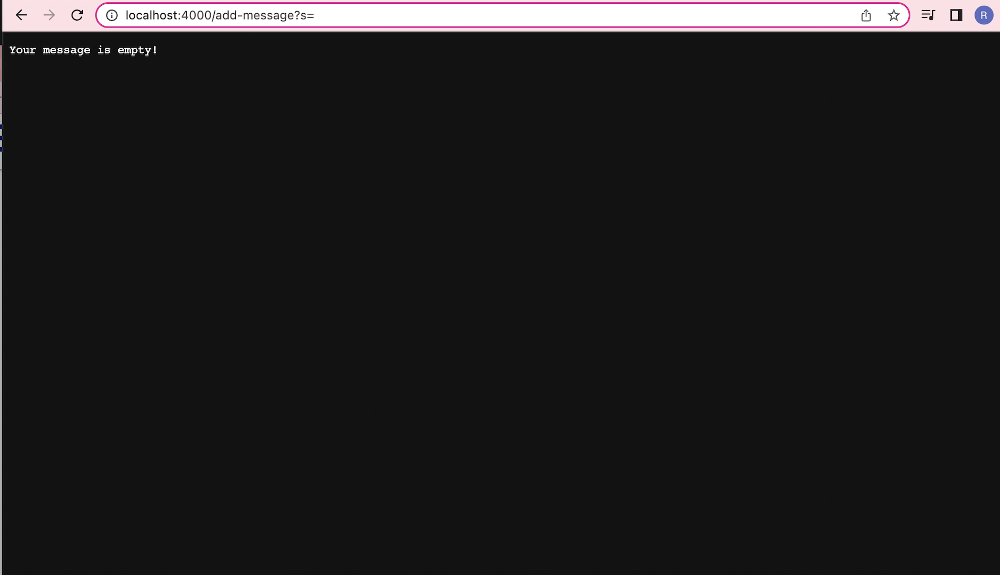

#Lab 2 Report
##Part 1
###Below is the code for StringServer

```
import java.io.IOException;
import java.net.URI;

class Handler implements URLHandler {
    
    String message = "";

    public String handleRequest(URI url) {
            if(url.getPath().equals("/"))
            {
                return "hi! use /add-message?s=<string> to print a message";
            }
            else if (url.getPath().contains("/add-message")) {
                String[] parameters = url.getQuery().split("=");
                if(parameters.length < 2)
                {
                    return "Your message is empty!";
                }
                else if (parameters[0].equals("s")) {
                    message += "\n";
                    message += parameters[1];
                    return message;
                }
            }
            return "404 Not Found!";
        }
    }


class StringServer {
    public static void main(String[] args) throws IOException {
        if(args.length == 0){
            System.out.println("Missing port number! Try any number between 1024 to 49151");
            return;
        }

        int port = Integer.parseInt(args[0]);

        Server.start(port, new Handler());
    }
}
```

###Below are two examples of using /add-message in StringServer

This adds the message "hello!" onto previous messages.

The handleRequest() method is called. The method takes in the url in the method's URI url parameter: "http://localhost:4000/add-message?s=hello!". 
The "add-message" part of the parameter helps identify the request, and s= parameter is the message. In StringServer, there is a field called message 
of type String, keeps track of all the messages. Before any requests are called, message is equal to "". 
Before the request is called specifically in the example, message is equal to: 
"hi
ham
bur
123
2432bfervg"

Once the request is called, the message field is then changed to:
"hi
ham
bur
123
2432bfervg
hello!"


###This shows the result of inputting a blank  message.

In this example, the handleRequest() method is also called. The method takes in the url in the method's URI url parameter: "http://localhost:4000/add-message?s=hello!".
The method takes in the url in the method's URI url parameter: "http://localhost:4000/add-message?s=  ". 
A message stating "your message is blank" is simply printed, so the message field is left unchanged in this example. 
Right before and after this example message is equal to:
"hi
ham
bur
123
2432bfervg
hello!"

##Part 2
###Below is the failure inducing input for the bug I chose in Lab3.
```
@Test
  public void testReversed() {
    int[] input1 = {1, 2, 3, 4};
    assertArrayEquals(new int[]{4, 3, 2, 1}, ArrayExamples.reversed(input1));
  }
```
###Below is the input that doesn't induce a failure for the bug I chose in Lab3.
```
public void testReversed() {
    int[] input1 = {4};
    assertArrayEquals(new int[]{4}, ArrayExamples.reversed(input1));
  }
```

###The symptom, with the test {1, 2, 3, 4}:


###Output with the test {0}, which doesn't fail the test:


###Original code with Bug:
```
 static int[] reversed(int[] arr) {
    int[] newArray = new int[arr.length];
    for(int i = 0; i < arr.length; i += 1) {
      arr[i] = newArray[arr.length - i - 1];
    }
    return arr;
  }
```

###Fixed code without bug:
```
static int[] reversed(int[] arr) {
    int[] newArray = new int[arr.length];
    for(int i = 0; i < arr.length; i += 1) {
      newArray[i] = arr[arr.length - i - 1];
    }
    return newArray;
  }
```
The issue was the original code both altered and returned the original array, when it was supposed to alter the values of the new array 
then return it. The fixed code now iterates through arr in reverse and saves it into newArray, then returns newArray.


##Part 3
I had no idea testing frameworks like JUnit existed before I participated in lab3. I thought testing always had to be done with methods like a debugger or manually debugging
through print statements. In the lab I specifically learned the code I could write if I ever wanted to run tests on a program I've wrote. After importing 
"import static org.junit.Assert.*" and "import org.junit.*;", I can write methods to tests parts of my code by putting "@Test" before the method I declare. 
I can then create an input to test, my expected output from that input, then run the code I want to test in my test method.
Then, I can use the method assertArrayEquals() to compare my input to what I would expect, producing errors if there are any discrepancies
between my input and expected output.

