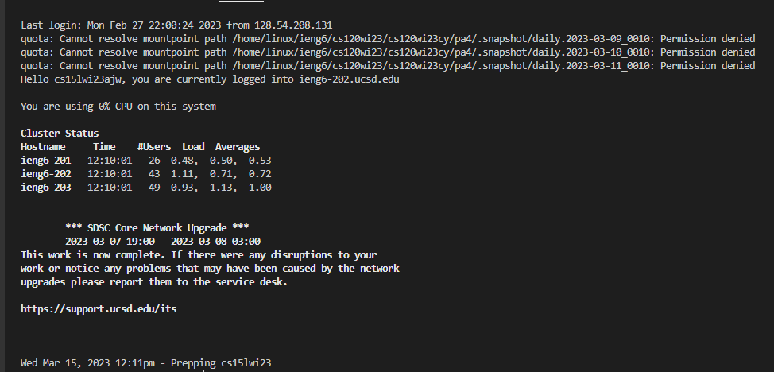
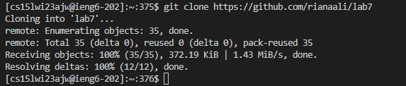
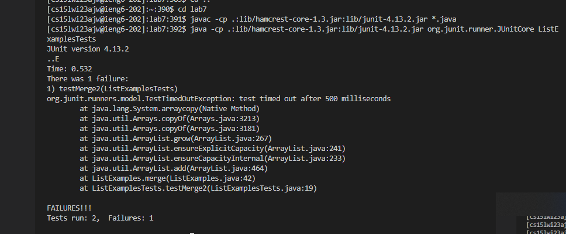
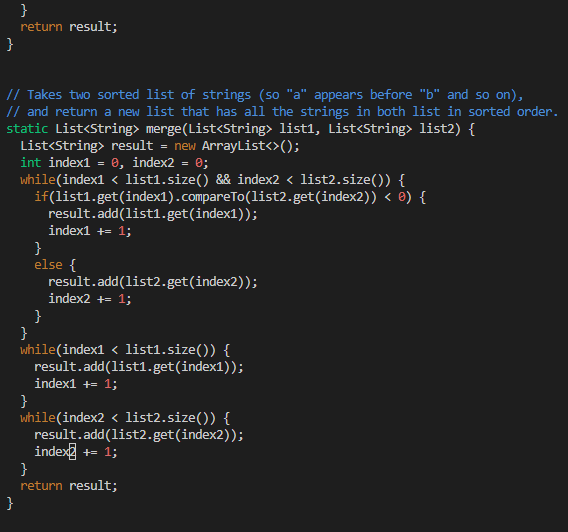
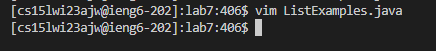
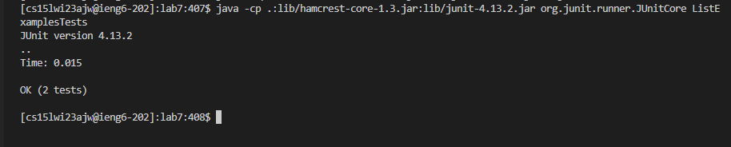
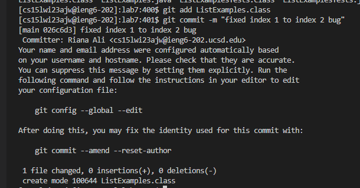

# Lab 4: Running through challenge tasks
### Below I will summarize the keys pressed to speed up the challenge tasks listed in Week 7's Lab
1. Log into ieng6
 
  
#### Keys Pressed: 
    `<up> <enter>`
  
 #### Summary: 
For this first task, the command to log into my ssh account (cs15lwi23zz@ieng6.ucsd.edu), was one up my search history. As a result, I used     the  arrow key once then pressed enter. Since I generated an SSH key on my computer as well, I automated my login and was not prompted for a     password.
  
2. Clone your fork of the repository from your Github account
  
    
  #### Keys Pressed: 
    ``<Ctrl + V> <enter>``
  
  
  #### Summary: 
   For the second task, I simply pasted the command which clones the lab7 repository I have previously forked. The command was already copied on 
   my computer's clipboard.
  
3. Run the tests, demonstrating that they fail
  
  
  #### Keys Pressed: 
    ``<up><up><up><up><up><enter>``
  
  #### Summary: 
   The javac -cp .:lib/hamcrest-core-1.3.jar:lib/junit-4.13.2.jar *.java command was 5 up in the search history. I used up arrow key 5 times  
   in order to access then enter it. Similarly, the java -cp .:lib/hamcrest-core-1.3.jar:lib/junit-4.13.2.jar org.junit.runner.JUnitCore      
   ListExamplesTest command was 5 up in the history, so I accessed and ran it in the same way.

4. Edit the code file to fix the failing test

  #### Keys Pressed: 
    ``<Ctrl + R> <v> <enter> <down>(held dow until row 43) <right>(held down until column 12) <backspace> <i> <2> <esc> <:wq> <enter>``
   
   
  #### Summary:
   To edit the code and fix the bug, I used vim. First I search for the command vim ListExamples.java, which I had used previously, in order 
   to access it more efficiently. After entering vim, I scrolled down to the error, editing index1 to index2 on row 43, column 12. I then  
   pressed escape and saved my changes.
     
5. Run the tests, demonstrating that they now succeed
  
    
   #### Keys Pressed: 
    ``<up><up><up><enter>``
  
   #### Summary: 
   I ran the same commands in step 3 to rerun the tests, where javac -cp .:lib/hamcrest-core-1.3.jar:lib/junit-4.13.2.jar *.java was now up 3 
   in my search history and java -cp .:lib/hamcrest-core-1.3.jar:lib/junit-4.13.2.jar org.junit.runner.JUnitCore ListExamplesTest was then up 3 
   as well.
  
6. Commit and push the resulting change to your Github account (you can pick any commit message!)
  
    
 #### Keys Pressed: 
      ``<up><up><up><up><up><up><enter>``
  
  
 #### Summary: 
   To run the commands "git add ListExamples.class" and "git commit -m "fixed index 1 to index 2 bug"", I also used my search history. The git 
   add command was up 6 in my search history, so I pressed the error key 6 times. I accesed the git message command in the same way.
  

  

  
